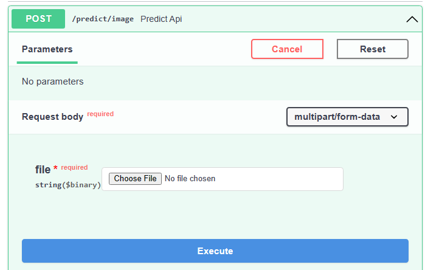
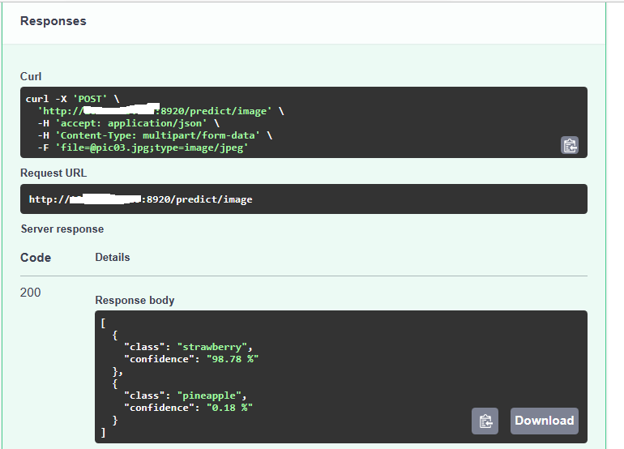

# FastAPI demo

This web app is created with [FastAPI](https://fastapi.tiangolo.com/) which is high performance asynchronous library for fast development of APIs.

It automatically generates SwaggerUI for APIs.

## Upload any photo andd try it out 

## How to run?

`python -m venv venv/fastapi`
`source venv/fastapi/bin/activate`
`pip install -r requirements.txt`

If you use conda, run
`conda install -c conda-forge --file requirements.txt`

### start app
`uvicorn application.server.main:app --host 0.0.0.0 --port 8900`


### Test with curl

```Shell
curl -X 'POST' \
  'http://localhost:9500/predict/image' \
  -H 'accept: application/json' \
  -H 'Content-Type: multipart/form-data' \
  -F 'file=@test/pic03.jpg;type=image/jpeg'
```

## Create docker container for deplolyment
``
`docker build -t fastapi_app .`
`docker images`
`docker run  -e "PORT=8900" -it --rm -p 8920:8900 fastapi_app`


## Screenshots

### SwaggerUI


### Response


### credit GitHub repo: https://github.com/aniketmaurya/tensorflow-fastapi-starter-pack
